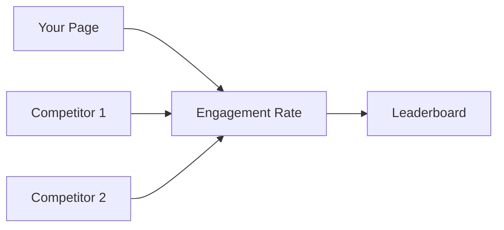

## Overview

Wicked Baron empowers you to gain deep insights into your Facebook audience and content performance. Access the tool at [fbaudienceanalyzer.abacusai.app](https://fbaudienceanalyzer.abacusai.app) to segment users, track engagement, and optimize strategies. You can analyze demographics like age, gender, and location, monitor post interactions, receive AI-driven recommendations, benchmark against competitors, and generate custom reports.

<Callout kind="tip">
  Connect your Facebook account to start analyzing. Ensure you have admin access to the pages you want to track.
</Callout>

## Key Features

Discover the core capabilities through these highlighted features.

<Columns cols={3}>
  <Card title="Audience Segmentation" icon="users" href="#audience-segmentation">
    Break down your followers by demographics and interests for targeted strategies.
  </Card>
  <Card title="Post Engagement Analytics" icon="bar-chart-3" href="#post-engagement">
    Track likes, shares, comments, and reach to identify top-performing content.
  </Card>
  <Card title="Content Optimization" icon="zap" href="#content-optimization">
    Get AI recommendations to boost future posts based on historical data.
  </Card>
  <Card title="Competitor Benchmarking" icon="trending-up" href="#benchmarking">
    Compare your metrics against competitors for competitive edge.
  </Card>
  <Card title="Custom Reports" icon="file-text" href="#custom-reports">
    Build and export visualizations tailored to your needs.
  </Card>
</Columns>

## Audience Segmentation and Demographics

Dive into your audience details to understand who engages with your content.

<Tabs>
  <Tab title="Dashboard View" icon="monitor">
    Navigate to the Audience tab. Filter by time range and view pie charts for age (`18-24`), gender, and top locations.
  </Tab>
  <Tab title="Advanced Filters" icon="filter">
    Apply segments like `interests: technology` or `location: US` to refine analysis.
  </Tab>
</Tabs>

<Steps>
  <Step title="Access Segments" icon="search">
    Select your Facebook page from the dashboard.
  </Step>
  <Step title="Apply Filters">
    Choose demographics from the sidebar. View real-time charts.
  </Step>
  <Step title="Export Data">
    Download CSV with segmented user stats.
  </Step>
</Steps>

## Post Engagement Analytics

Measure how your posts perform across metrics.

```javascript
// Example API call to fetch post analytics
const response = await fetch('https://api.example.com/v1/posts/analytics', {
  headers: { 'Authorization': 'Bearer YOUR_API_KEY' }
});
const data = await response.json();
console.log(data.engagement); // { likes: 1500, shares: 320, comments: 89 }
```

| Metric       | Description                          | Benchmark (> average) |
|--------------|--------------------------------------|------------------------|
| Likes        | Total reactions to post              | `>500`                |
| Shares       | Content distribution by users        | `>100`                |
| Comments     | Conversation depth                   | `>50`                 |
| Reach        | Unique viewers                       | `>10k`                |

<Callout kind="success">
  Posts with images see `2x` higher engagement than text-only.
</Callout>

## Content Optimization Recommendations

Receive actionable AI insights.

<Expandable title="View Recommendations" default-open="true">
  Wicked Baron analyzes past performance and suggests optimal posting times, content types, and hashtags. For example, post videos on Wednesdays at `2 PM EST` for max reach.
</Expandable>

## Performance Benchmarking Against Competitors

Compare your page to others.



Enter competitor Facebook page IDs to see side-by-side metrics like engagement rate and growth.

## Customizable Reports and Visualizations

Tailor reports to your dashboard.

<CodeGroup tabs="JavaScript,Python">
  ```javascript
  // Embed report in your app
  const embedId = 'report-abc123';
  const iframe = `<iframe src="https://fbaudienceanalyzer.abacusai.app/embed/${embedId}?token=YOUR_TOKEN" width="100%" height="600"></iframe>`;
  document.getElementById('report-container').innerHTML = iframe;
  ```
  ```python
  # Generate report via API
  import requests
  response = requests.post('https://api.example.com/v1/reports', json={
    'page_id': 'your-page-id',
    'metrics': ['engagement', 'demographics']
  }, headers={'Authorization': 'Bearer YOUR_API_KEY'})
  print(response.json()['report_url'])
  ```
</CodeGroup>

<Columns cols={2}>
  <Card title="Next: Quickstart" icon="rocket" href="/quickstart">
    Set up Wicked Baron in minutes.
  </Card>
  <Card title="API Reference" icon="code" href="/authentication">
    Integrate programmatically.
  </Card>
</Columns>