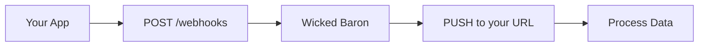

## Overview

Wicked Baron integrates seamlessly with popular third-party tools to enhance your Facebook analytics workflow. Connect your Facebook pages directly, set up webhooks for real-time notifications, export data to Google Sheets or BI platforms, and build custom solutions via API.

<Columns cols={3}>
  <Card title="Facebook API" icon="facebook" href="#facebook-api">
    Authorize access to your Facebook pages and posts.
  </Card>
  <Card title="Webhooks" icon="zap" href="#webhooks">
    Receive instant alerts on performance metrics.
  </Card>
  <Card title="Exports" icon="download" href="#exports">
    Sync data to Sheets, Airtable, or Tableau.
  </Card>
</Columns>

## Facebook API Connection

Connect Wicked Baron to the Facebook Graph API to pull page and post insights automatically.

<Steps>
  <Step title="Create Facebook App" icon="settings">
    Go to [Facebook Developers](https://developers.facebook.com/) and create a new app. Select `Business` type and add the `pages_read_engagement` permission.
  </Step>
  <Step title="Generate Access Token" icon="key">
    Use the Graph API Explorer to generate a Page Access Token. Copy the token starting with `EAA...`.
  </Step>
  <Step title="Add to Wicked Baron" icon="link">
    In your Wicked Baron dashboard at `https://fbaudienceanalyzer.abacusai.app`, navigate to Settings > Integrations. Paste the token and select your pages.
  </Step>
</Steps>

<Callout kind="tip">
  Renew tokens every 60 days to avoid interruptions. Test the connection immediately after setup.
</Callout>

## Webhooks for Real-Time Alerts

Set up webhooks to receive push notifications when post engagement exceeds thresholds, like `>1000` likes in 24 hours.

Configure webhooks in your dashboard under Integrations > Webhooks. Provide your endpoint URL, such as `https://your-webhook-url.com/wickedbaron`.

<Request tabs="cURL,JavaScript" show-lines="true">
  ```bash
  curl -X POST https://api.example.com/v1/webhooks \
    -H "Authorization: Bearer YOUR_API_KEY" \
    -H "Content-Type: application/json" \
    -d '{
      "url": "https://your-webhook-url.com/events",
      "events": ["post_engagement", "page_growth"],
      "secret": "your-webhook-secret"
    }'
  ```
  ```javascript
  const response = await fetch('https://api.example.com/v1/webhooks', {
    method: 'POST',
    headers: {
      'Authorization': 'Bearer YOUR_API_KEY',
      'Content-Type': 'application/json'
    },
    body: JSON.stringify({
      url: 'https://your-webhook-url.com/events',
      events: ['post_engagement', 'page_growth'],
      secret: 'your-webhook-secret'
    })
  });
  ```
</Request>

Example payload received at your endpoint:

<Response tabs="Success,Threshold Exceeded">
  ```json
  {
    "event": "post_engagement",
    "page_id": "123456789",
    "post_id": "987654321",
    "likes": 1500,
    "timestamp": "2024-10-15T12:00:00Z"
  }
  ```
  ```json
  {
    "event": "threshold_exceeded",
    "metric": "likes_24h",
    "value": 1200,
    "threshold": 1000,
    "page_id": "123456789"
  }
  ```
</Response>

## Marketing Automation Integrations

Integrate with tools like Zapier or Make.com for automated workflows.

<Tabs>
  <Tab title="Zapier" icon="zap">
    <Steps>
      <Step title="Trigger Setup">
        Select Wicked Baron as trigger app. Choose `New Engagement Alert`.
      </Step>
      <Step title="Action">
        Connect to email, Slack, or CRM. Map fields like `{post_id}` and `{likes}`.
      </Step>
    </Steps>
  </Tab>
  <Tab title="Make.com" icon="play">
    Create a scenario with Wicked Baron webhook module. Parse JSON payload and route to Google Sheets or HubSpot.
  </Tab>
</Tabs>

## Data Exports

Export analytics to spreadsheets or BI tools without coding.

### Google Sheets

Use the built-in exporter:

<CodeGroup tabs="Zapier,Direct API">
  ```javascript
  // Google Apps Script to fetch from Wicked Baron
  function importWickedBaronData() {
    const url = 'https://api.example.com/v1/pages/123456789/insights';
    const response = UrlFetchApp.fetch(url, {
      headers: { 'Authorization': 'Bearer YOUR_API_KEY' }
    });
    const data = JSON.parse(response.getContentText());
    // Append to sheet
  }
  ```
  ```python
  import gspread
  import requests

  gc = gspread.service_account()
  sheet = gc.open("Wicked Baron Insights").sheet1

  resp = requests.get(
      'https://api.example.com/v1/pages/123456789/insights',
      headers={'Authorization': 'Bearer YOUR_API_KEY'}
  )
  data = resp.json()
  sheet.append_row([data['likes'], data['shares']])
  ```
</CodeGroup>

### BI Platforms

Connect via API to Tableau, Power BI, or Looker. Use the `/v1/insights` endpoint with query params.

<ParamField query="page_id" param-type="string" required="true">
  Facebook Page ID (e.g., `123456789`).
</ParamField>

<ParamField query="metric" param-type="string" required="false">
  Filter by `likes`, `shares`, `reach`. Default: all.
</ParamField>

## Custom API Integrations

For advanced use, access the full API at `https://api.example.com/v1`.



<Callout kind="alert">
  Always validate webhook signatures using the `secret` to prevent spoofing. Store `YOUR_API_KEY` securely.
</Callout>

<Expandable title="Troubleshooting Integrations" default-open="false">
  - **Webhook not firing?** Check endpoint logs and verify events match your subscription.
  - **Facebook token expired?** Regenerate via Graph API Explorer.
  - **Export limits?** Upgrade plan for higher quotas.
</Expandable>