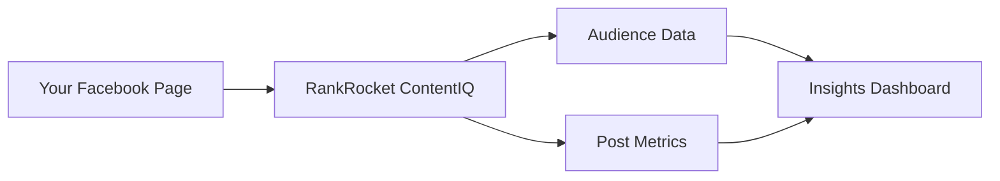

## Overview

RankRocket ContentIQ empowers you to gain deep insights into your Facebook page and post performance. Access the tool at `https://fbaudienceanalyzer.abacusai.app` to analyze audience demographics, engagement metrics, and content effectiveness. You optimize your strategy with data-driven recommendations that boost reach and interactions.

This tool integrates seamlessly with Facebook data, providing real-time analytics without complex setups. Marketers, social media managers, and page owners use it to refine content, target audiences better, and measure ROI effectively.

<Callout kind="info">
RankRocket ContentIQ processes your Facebook data securely, complying with platform policies and privacy standards.
</Callout>

## Key Features

RankRocket ContentIQ offers powerful tools for audience analysis and optimization.

<Columns cols={3}>
  <Card title="Audience Insights" icon="users" href="#audience-insights">
    Discover demographics, interests, and behaviors of your followers.
  </Card>
  <Card title="Post Performance" icon="bar-chart-3" href="#post-performance">
    Track likes, shares, comments, and reach for every post.
  </Card>
  <Card title="Optimization Tips" icon="zap" href="#optimization">
    Get AI-powered suggestions to improve engagement.
  </Card>
</Columns>

## How It Integrates with Facebook

RankRocket ContentIQ connects directly to your Facebook account for effortless data syncing.



You authorize access once, and RankRocket ContentIQ pulls performance data automatically. No manual exports or APIs required.

<Tabs>
  <Tab title="Pages" icon="book-open">
    Analyze page-level metrics like follower growth and top-performing content.
  </Tab>
  <Tab title="Posts" icon="message-circle">
    Dive into individual post analytics, including peak engagement times.
  </Tab>
</Tabs>

## Who Should Use RankRocket ContentIQ

<Callout kind="tip">
Ideal for social media managers, content creators, digital marketers, and small business owners managing Facebook pages. Start if you want to turn raw data into actionable strategies.
</Callout>

## Quick Start

Get up and running in minutes.

<Steps>
  <Step title="Connect Facebook" icon="link">
    Visit `https://app.wickedbaron.com` and sign in with Facebook.
  </Step>
  <Step title="Select Page" icon="select">
    Choose your page from the list.
  </Step>
  <Step title="View Insights" icon="bar-chart">
    Explore the dashboard for immediate audience and post data.
  </Step>
</Steps>

<CodeGroup tabs="Dashboard Access">
````javascript
// Example: Fetch initial data (for advanced users)
const response = await fetch('https://api.example.com/pages/your-page-id/insights', {
  headers: { Authorization: `Bearer ${YOUR_TOKEN}` }
});
const insights = await response.json();
console.log(insights.audience);
````

````python
# Python example for data export
import requests
response = requests.get(
    'https://api.example.com/pages/your-page-id/insights',
    headers={'Authorization': f'Bearer ${YOUR_TOKEN}'}
)
insights = response.json()
print(insights['audience'])
````
</CodeGroup>

## Next Steps

<Columns cols={2}>
  <Card title="Quickstart Guide" icon="rocket" href="/quickstart">
    Detailed setup and first analysis.
  </Card>
  <Card title="Authentication" icon="lock" href="/authentication">
    Secure your data connection.
  </Card>
  <Card title="Advanced Features" icon="settings" href="/configuration">
    Customize reports and alerts.
  </Card>
  <Card title="Changelog" icon="git-branch" href="/changelog">
    Stay updated with new releases.
  </Card>
</Columns>